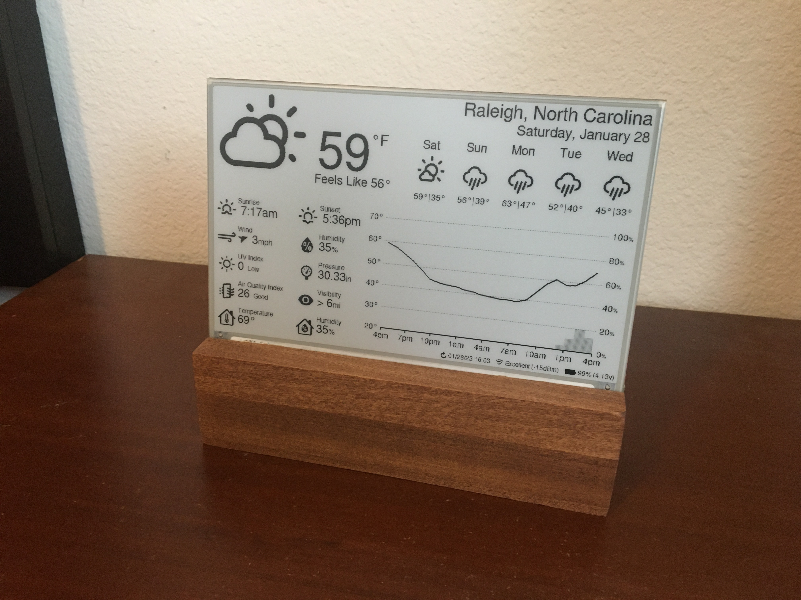
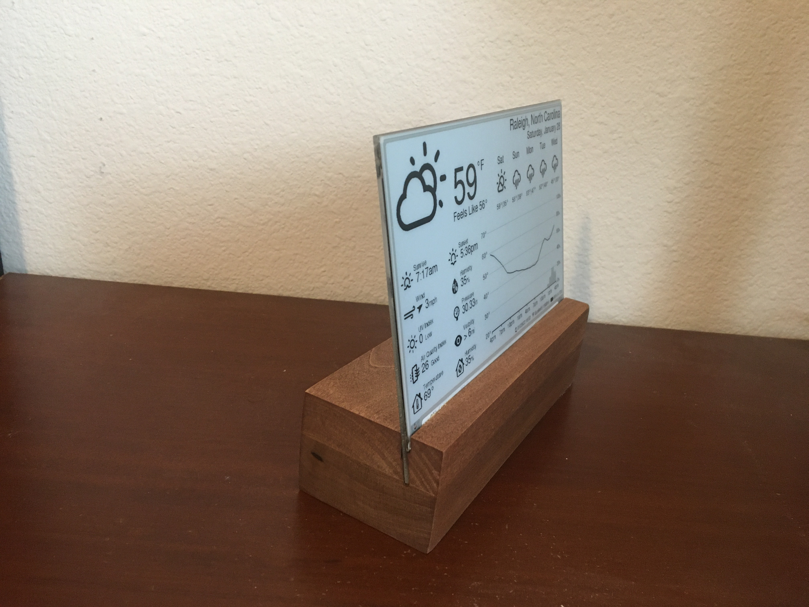
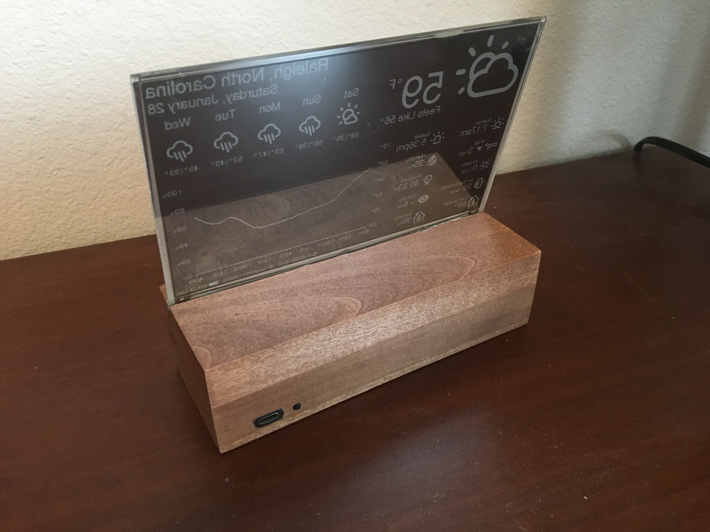
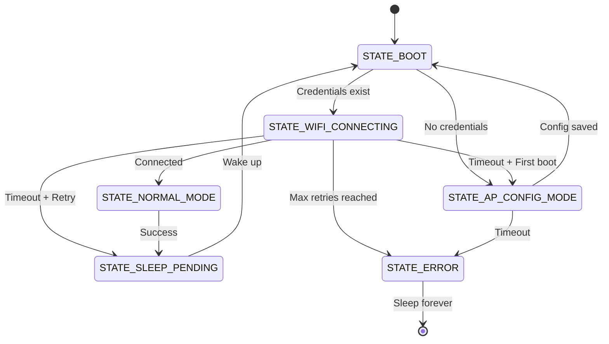

# ESP32 E-Paper Weather Display

A low-power weather display powered by an ESP32 and a 7.5" e-paper panel. Uses **Open-Meteo** for free weather data (no API key required).

<p float="left">
  
  
  
</p>

---

## Quick Start

```bash
cd platformio
pio run
pio run --target upload
pio device monitor --baud 115200
```

### First Boot

On first boot, the device creates a Wi-Fi access point for configuration.

---

## Setup

### Web Portal (Recommended)

1. **Power on the device**
2. Scan the QR code on the display, or connect to `weather_eink-AP`
3. Open: http://192.168.4.1 or http://weather.local
4. Configure WiFi credentials and location
5. Save → device restarts and begins updating

> **Security Note**: Setup runs over **unencrypted HTTP**. Perform on a trusted network.

### Alternative: Environment Variables

Create `.env` in the `platformio/` directory:

```env
WIFI_SSID=your_wifi
WIFI_PASSWORD=your_password
```

---

## State Machine

The firmware uses a deterministic state machine with deep sleep. For complete details, see [`docs/STATE_MACHINE.md`](docs/STATE_MACHINE.md).



---

## Features

- **No API Key** – Open-Meteo (free, personal use)
- **Easy Setup** – Captive portal with auto mobile detection
- **Auto Location** – Optional IP-based geolocation
- **Umbrella Indicator** – Rain probability at a glance
- **Offline Mode** – Full simulation without WiFi

---

## Development & Testing

### Offline Mode (No WiFi)

Enable in `include/config.h`:

```c
#define USE_MOCKUP_DATA 1
```

Available scenarios: SUNNY, RAINY, SNOWY, CLOUDY, THUNDER

### Testing with Saved API Data

Test with real API responses without making live calls:

```bash
# 1. Download an API response (example for New York)
curl "https://api.open-meteo.com/v1/forecast?latitude=-3.10&longitude=-60.02&current=temperature_2m,apparent_temperature,is_day,weather_code,precipitation,rain,showers,snowfall,relative_humidity_2m,wind_speed_10m,wind_direction_10m,wind_gusts_10m,pressure_msl,surface_pressure&hourly=temperature_2m,precipitation_probability,precipitation,wind_speed_10m,wind_direction_10m,wind_gusts_10m,weather_code,is_day&daily=weather_code,temperature_2m_max,temperature_2m_min,sunrise,sunset,precipitation_probability_max,precipitation_sum&timezone=auto&forecast_days=8" \
  -o api_response.json

# 2. Convert to C++ header
cd platformio
python json_to_header.py api_response.json

# 3. Enable saved data mode in include/config.h
#define USE_SAVED_API_DATA 1

# 4. Build and run
pio run -e esp32dev
```

Useful for:
- Testing with consistent/known data
- Avoiding API rate limits
- Faster development cycles

### Local Testing with act

Run GitHub Actions workflows locally using [act](https://github.com/nektos/act):

```bash
# Install act
brew install act  # macOS
curl -s https://raw.githubusercontent.com/nektos/act/master/install.sh | sudo bash  # Linux

# Run a specific job
act -j <job-name> -P ubuntu-latest=catthehacker/ubuntu:act-latest

# List available jobs
act -l
```

**Available Workflows:**

| Workflow | Job Name | Description | Requirements |
|----------|----------|-------------|--------------|
| `state-machine.yml` | `test-state-machine` | Unit tests (fast) | None |
| `blackbox.yml` | `blackbox-test` | Single integration test | Docker |
| `blackbox-matrix.yml` | `blackbox-matrix` | Matrix tests (14 envs) | Docker + artifact path |

**Examples:**

```bash
# Fast unit tests - no Docker required
act -j test-state-machine -P ubuntu-latest=catthehacker/ubuntu:act-latest

# Integration tests - requires Docker
act -j blackbox-test -P ubuntu-latest=catthehacker/ubuntu:act-latest

# Full matrix tests - save artifacts
act -j blackbox-matrix -P ubuntu-latest=catthehacker/ubuntu:act-latest --artifact-server-path /tmp/artifacts
```

---

## Troubleshooting

| Issue | Fix |
|-------|-----|
| Display not updating | Check SPI wiring and BUSY pin |
| WiFi fails | Verify credentials and signal strength |
| Time sync issues | Check timezone settings |

For deeper debugging, see `platformio/AGENTS.md`.

---

## Hardware

Current development setup:

* **ESP32 Board**
  E-Paper ESP32 Driver Board Rev 3

* **Display**
  Waveshare 7.5" e-paper (800×480, Black/White)

* **Adapter**
  Waveshare e-Paper adapter

* **Power**
  USB-powered

---

## License

GPL v3.0. See original project for full attribution.
