# esp32-WeatherPortal-EPD - ESP32 E-Paper Weather Display

A low-power weather station that displays real-time conditions and forecasts on a 7.5" e-paper display. Powered by ESP32 and [Open-Meteo API](https://open-meteo.com/) — no API key required for personal use.

> **Note:** This is a fork of the excellent [esp32-weather-epd](https://github.com/lmarzen/esp32-weather-epd) by [Luke Marzen](https://github.com/lmarzen).

<div align="center">
  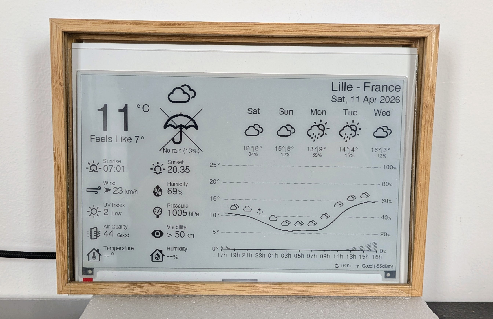
  
  <br/><br/>

  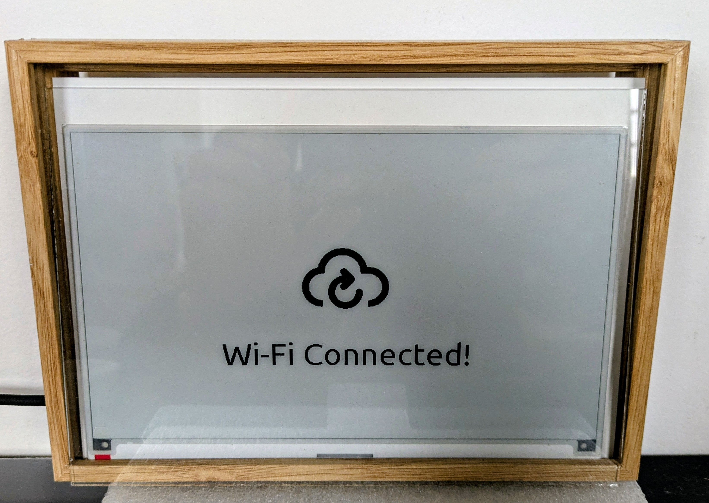
  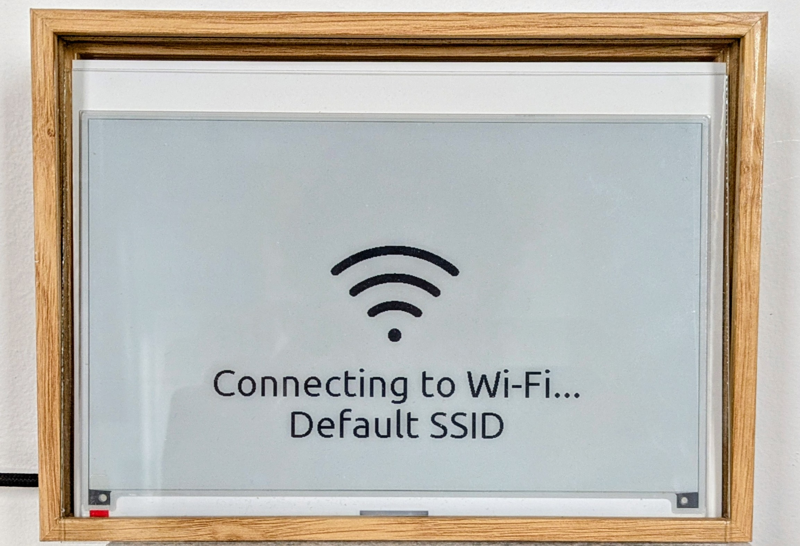

  <br/>

  <h3>Configuration Portal Interface</h3>

  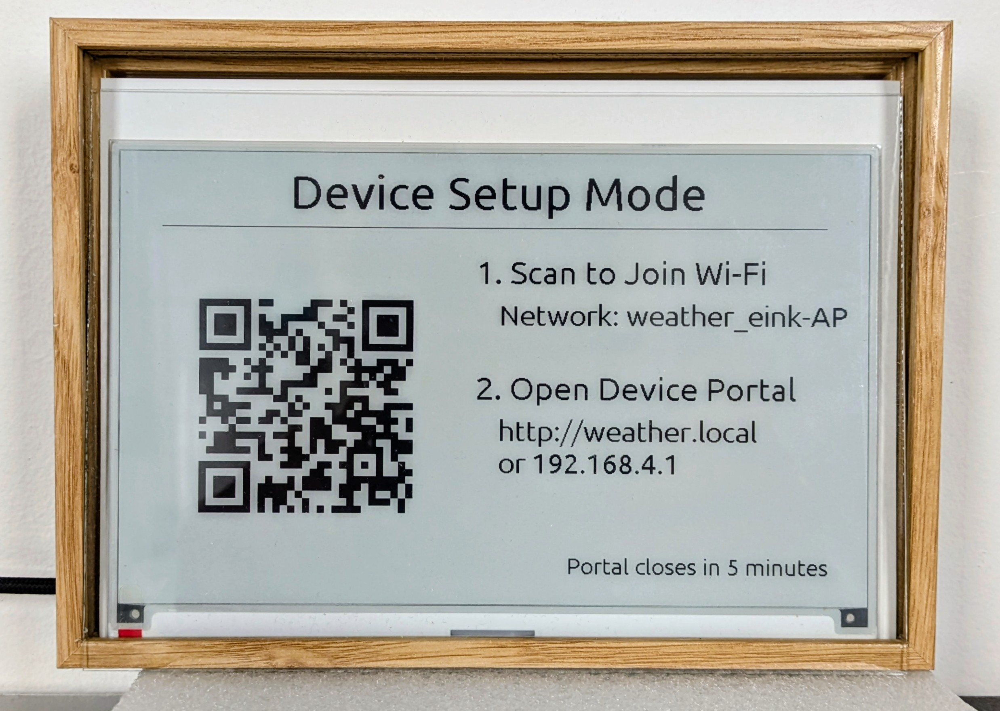
  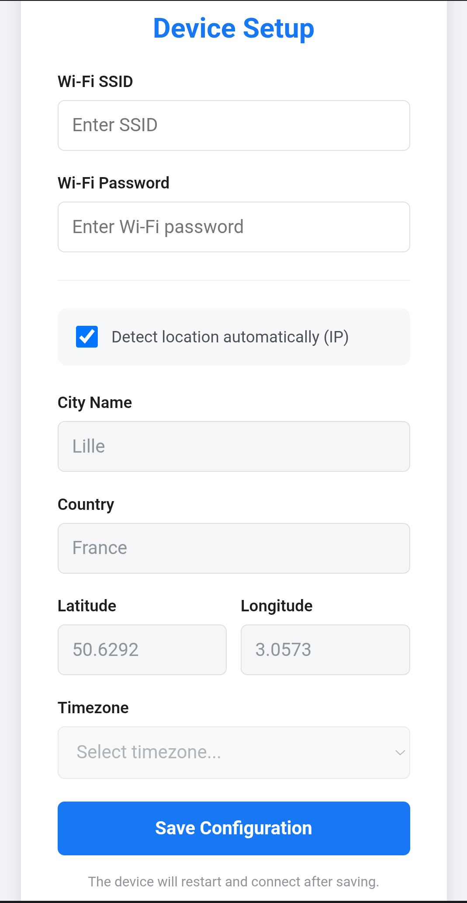
</div>

---

## Features

- **No API Key Required** — Free weather data via Open-Meteo
- **Easy Setup** — QR code + captive portal for mobile configuration
- **Auto Location** — IP-based geolocation (optional manual override)
- **Rain Alert** — Umbrella indicator with probability of precipitation
- **Low Power** — Deep sleep between updates
- **Offline Development** — Mock data mode for testing without WiFi
- **Multi-locale** — 10+ language support

---

## Requirements

### Hardware Tested ✓

<p align="center">
  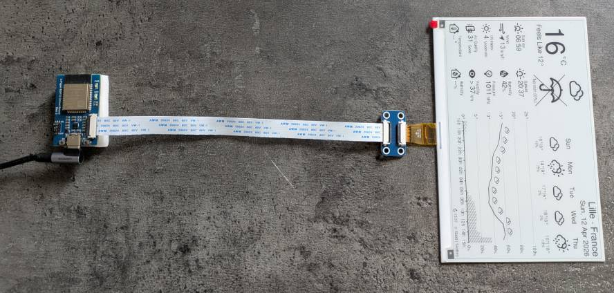
  <br/>
  <em>Tested hardware components</em>
</p>

| Component | Details |
|-----------|---------|
| **ESP32 Board** | E-Paper ESP32 Driver Board Rev 3 (or compatible) |
| **Display** | Waveshare 7.5" e-paper (800x480, Black/White) |
| **Adapter** | Waveshare e-Paper adapter |

> ⚠️ **Power Note:** This hardware configuration has been tested with **USB/external power supply only**. Battery operation (LiPo) with this specific driver board has **NOT been tested**.

### Software

- [PlatformIO Core](https://platformio.org/install) 6.0+
- Python 3.8+
- Git

---

## Quick Start

```bash
# Clone and build
cd platformio
pio run

# Upload to device
pio run --target upload

# Monitor serial output
pio device monitor --baud 115200
```

On first boot, the device creates a Wi-Fi access point named `weather_eink-AP`. Scan the QR code on the display or connect manually to configure.

---

## Setup

### Web Portal (Recommended)

1. Power on the device
2. Scan the QR code on screen, or connect to `weather_eink-AP`
3. Open http://192.168.4.1 or http://weather.local
4. Enter Wi-Fi credentials and location
5. Save — device restarts and begins updating

> **Security Note**: Setup runs over unencrypted HTTP. Perform on a trusted network.

### Alternative: Environment Variables

Create `platformio/.env`:

```env
WIFI_SSID=your_wifi
WIFI_PASSWORD=your_password
```

---

## How It Works

The firmware runs on a deterministic state machine that:

1. Connects to Wi-Fi (or enters setup mode on first boot)
2. Fetches weather data from Open-Meteo
3. Renders current conditions and forecast to the e-paper display
4. Enters deep sleep to conserve power
5. Wakes up after the configured interval and repeats

Persistent state (credentials, failure counters) survives deep sleep in RTC memory.

**Read more**: [State Machine Documentation](docs/STATE_MACHINE.md)

---

## Development & Testing

### Offline Mode (No WiFi)

Edit `include/config.h`:

```cpp
#define USE_MOCKUP_DATA 1
```

The device will run with synthetic data, executing the full state machine (boot → WiFi simulation → fetch simulation → dashboard → sleep) without requiring network access.

### Saved API Data Mode

Use real API data without making live calls:

```cpp
#define USE_SAVED_API_DATA 1
```

Generate `include/saved_api_response.h` from captured JSON:

```bash
python json_to_header.py api_response.json
```

### Running Tests

```bash
# Unit tests (native, no hardware required)
platformio test -e native
```

---

## ⚠️ Legacy Documentation (Not Tested)

> **The following sections are preserved from the original project documentation for reference only.**
> They describe alternative hardware configurations, setup methods, and features that have **NOT been personally tested** by the current maintainer. Use at your own risk.

---

### Original Project Showcase

<p float="left">
  
  
   
  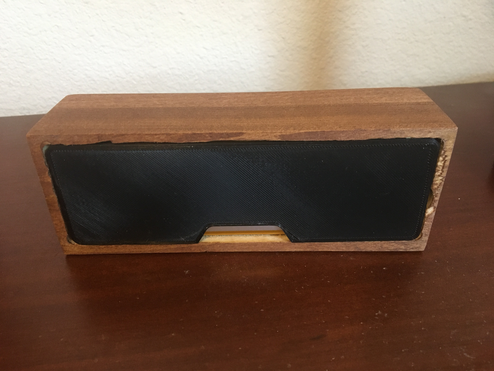
  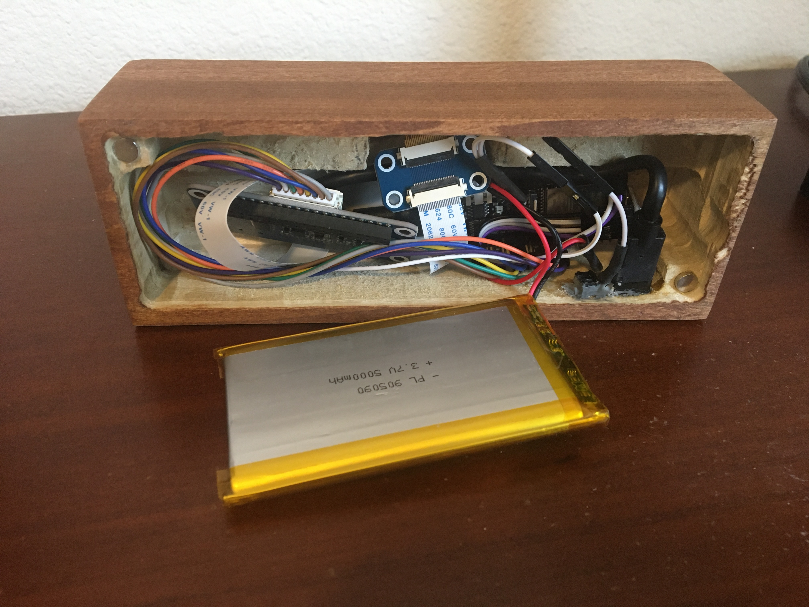 
</p>


I made a small stand by hollowing out a piece of wood from the bottom. On the back, I used a short USB extension cable so that I can charge the battery without needing to remove the components from the stand. I also wired a small reset button to refresh the display manually. Additionally, I 3d printed a cover for the bottom, which is held on by magnets. The E-paper screen is very thin, so I used a thin piece of acrylic to support it.

Here are two examples utilizing various configuration options:

<p float="left">
  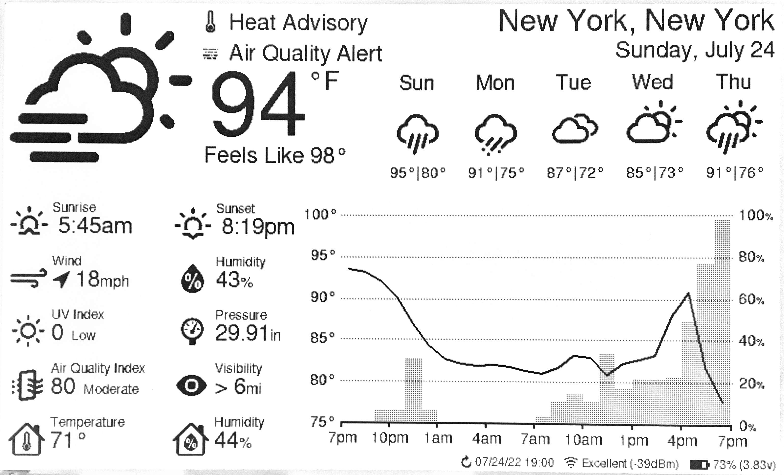
  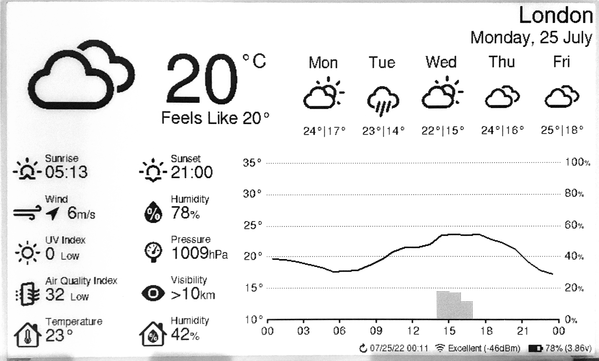 
</p>

### Setup Guide (Legacy)

#### Hardware

7.5inch (800×480) E-Ink Display w/ HAT for Raspberry Pi, SPI interface

- Advantages of E-Paper
  - Ultra Low Power Consumption - E-Paper (or E-Ink) displays are ideal for low-power applications that do not require frequent display refreshes. E-Paper displays only draw power when refreshing the display and do not have a backlight. Images will remain on the screen even when power is removed.

- Limitations of E-Paper: 
  - Colors - E-Paper has traditionally been limited to just black and white, but in recent years 3-color E-Paper screens have started showing up.

  - Refresh Times and Ghosting - E-Paper displays are highly susceptible to ghosting effects if refreshed too quickly. To avoid this, E-Paper displays often take a few seconds to refresh(4s for the unit used in this project) and will alternate between black and white a few times, which can be distracting.  


- https://www.waveshare.com/product/7.5inch-e-paper-hat.htm (800x480, 7.5inch E-Ink display, Black/White)

- Note that this project also now supports this 3-color panel as well, though the program will only draw black/white to the screen. https://www.waveshare.com/product/7.5inch-e-paper-hat-b.htm (800x480, 7.5inch E-Ink display, Red/Black/White) 


FireBeetle 2 ESP32-E Microcontroller

- Why the ESP32?

  - Onboard WiFi.

  - 520kB of RAM and 4MB of FLASH, enough to store lots of icons and fonts.

  - Low power consumption.

  - Small size, many small development boards available.

- Why the FireBeetle 2 ESP32-E

  - Drobot's FireBeetle ESP32 models are optimized for low-power consumption (https://diyi0t.com/reduce-the-esp32-power-consumption/). The Drobot's FireBeetle 2 ESP32-E variant offers USB-C, but older versions of the board with Mirco-USB would work fine too.

  - Firebeelte ESP32 models include onboard charging circuitry for a 3.7v lithium-ion(LiPo) battery.

  - FireBeetle ESP32 models include onboard circuitry to monitor battery voltage of a battery connected to its JST-PH2.0 connector.


- https://www.dfrobot.com/product-2195.html 


BME280 - Pressure, Temperature, and Humidity Sensor


- Provides accurate indoor temperature and humidity.

- Much faster than the DHT22, which requires a 2-second wait before reading temperature and humidity samples.


3.7V Lipo Battery w/ 2 Pin JST Connector 


- Size is up to you. I used a 10000mah battery so that the device can operate on a single charge for >1 year.


- The battery can be charged by plugging the FireBeetle ESP32 into the wall via the USB-C connector while the battery is plugged into the ESP32's JST connector.

  > **Warning**
  > The polarity of JST-PH2.0 connectors is not standardized! You may need to swap the order of the wires in the connector.


#### Wiring

Pin connections are defined in config.cpp. 

If you are using the FireBeetle 2 ESP32-E, you can use the connections I used or change them how you would like.

IMPORTANT: The E-Paper Driver Hat has two physical switches that MUST be set correctly for the display to work.

- Display Config: Set switch to position B.
- Interface Config: Set switch to position 0.

Cut the low power pad for even longer battery life.

- From https://wiki.dfrobot.com/FireBeetle_Board_ESP32_E_SKU_DFR0654

  > Low Power Pad: This pad is specially designed for low power consumption. It is connected by default. You can cut off the thin wire in the middle with a knife to disconnect it. After disconnection, the static power consumption can be reduced by 500 μA. The power consumption can be reduced to 13 μA after controlling the maincontroller enter the sleep mode through the program. Note: when the pad is disconnected, you can only drive RGB LED light via the USB Power supply. 

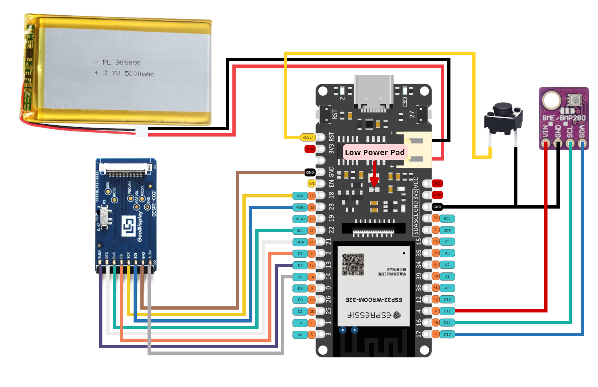

<p float="left">
  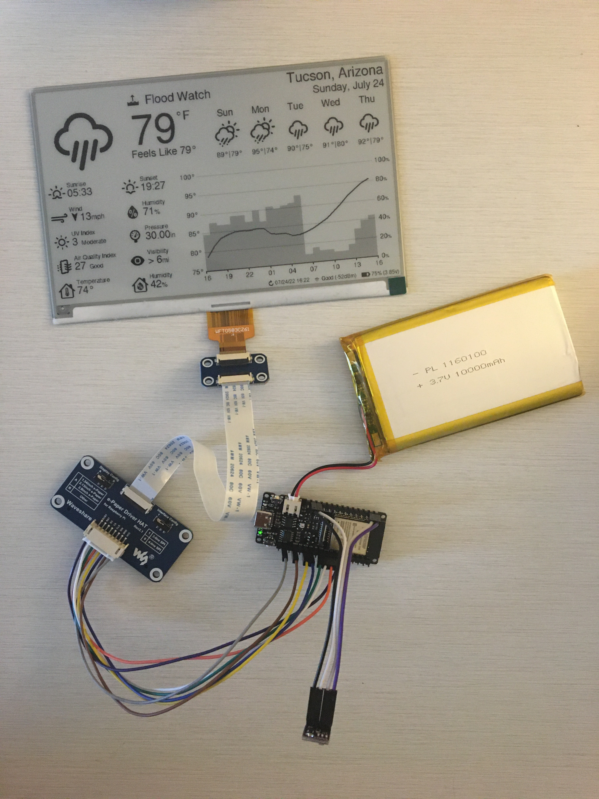
</p>


#### Configuration, Compilation, and Upload

PlatformIO for VSCode is used for managing dependencies, code compilation, and uploading to ESP32.

1. Clone this repository or download and extract the .zip.

2. Install VSCode.

3. Follow these instructions to install the PlatformIO extension for VSCode: https://platformio.org/install/ide?install=vscode

4. Open the project in VSCode.

   a. File > Open Folder...

   b. Navigate to this project and select the folder called "platformio".

5. Configure Options.

   - Most configuration options are located in config.cpp, with a few  in config.h. Locale/language options can also be found in locales/locale_**.cpp.

   - Important settings to configure in config.cpp:

     - WiFi credentials (ssid, password).

     - Open Weather Map API key (it's free, see next section for important notes about obtaining an API key).

     - Latitude and longitude.

     - Time and date formats.

     - Sleep duration.

     - Pin connections for E-Paper (SPI), BME280 (I2C), and battery voltage (ADC).

   - Important settings to configure in config.h:

     - Units (Metric or Imperial).

   - Comments explain each option in detail.

6. Build and Upload Code.

   a. Connect ESP32 to your computer via USB.

   b. Click the upload arrow along the bottom of the VSCode window. (Should say "PlatformIO: Upload" if you hover over it.) 

      - PlatformIO will automatically download the required third-party libraries, compile, and upload the code. :)
     
      - You will only see this if you have the PlatformIO extension installed.

      - If you are getting errors during the upload process, you may need to install drivers to allow you to upload code to the ESP32.

#### OpenWeatherMap API Key (Legacy)

> **Note:** The current project uses [Open-Meteo](https://open-meteo.com/) which does not require an API key. The following section is preserved for reference only.

Sign up here to get an API key; it's free. https://openweathermap.org/api

This project will make calls to 2 different APIs ("One Call" and "Air Pollution").

> **Note**
> OpenWeatherMap One Call 2.5 API has been deprecated for all new free users (accounts created after Summer 2022). Fortunately, you can make 1,000 calls/day to the One Call 3.0 API for free by following the steps below.

- If you have an account created before Summer 2022, you can simply use the One Call 2.5 API by changing `OWM_ONECALL_VERSION = "2.5";` in config.cpp.

- Otherwise, the One Call API 3.0 is only included in the "One Call by Call" subscription. This separate subscription includes 1,000 calls/day for free and allows you to pay only for the number of API calls made to this product.

Here's how to subscribe and avoid any credit card changes:
   - Go to https://home.openweathermap.org/subscriptions/billing_info/onecall_30/base?key=base&service=onecall_30
   - Follow the instructions to complete the subscription.
   - Go to https://home.openweathermap.org/subscriptions and set the "Calls per day (no more than)" to 1,000. This ensures you will never overrun the free calls.

### Error Messages and Troubleshooting (Legacy)

#### Low Battery
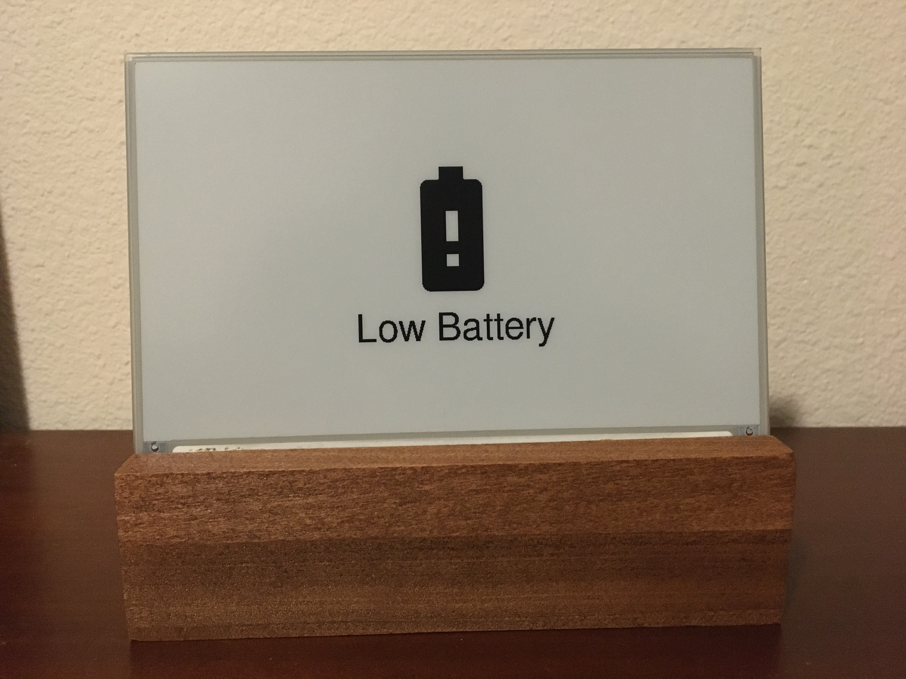
This error screen appears once the battery voltage has fallen below LOW_BATTERY_VOLTAGE (default = 3.20v). The display will not refresh again until it detects battery voltage above LOW_BATTERY_VOLTAGE. When battery voltage is between LOW_BATTERY_VOLTAGE and VERY_LOW_BATTERY_VOLTAGE (default = 3.10v) the esp32 will deep-sleep for periods of LOW_BATTERY_SLEEP_INTERVAL (default = 30min) before checking battery voltage again. If the battery voltage falls below CRIT_LOW_BATTERY_VOLTAGE then the display will deep-sleep for periods VERY_LOW_BATTERY_SLEEP_INTERVAL (default = 120min). If battery voltage falls to CRIT_LOW_BATTERY_VOLTAGE (default = 3.00v) then the esp32 will enter hibernate mode and will require a manual push of the reset (RST) button to begin updating again.

<br clear="left"/>

#### WiFi Connection
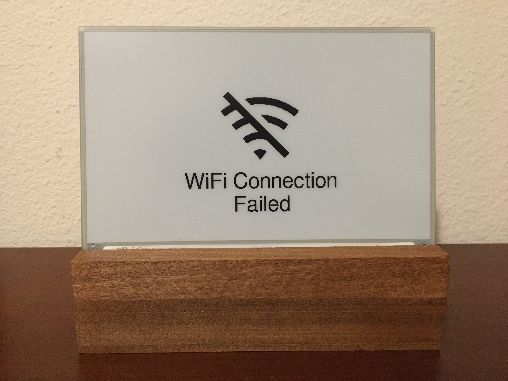
This error screen appears when the ESP32 fails to connect to WiFi. If the message reads "WiFi Connection Failed" this might indicate an incorrect password. If the message reads "SSID Not Available" this might indicate that you mistyped the SSID or that the esp32 is out of the range of the access point. The esp32 will retry once every SLEEP_DURATION (default = 30min).

<br clear="left"/>

#### API Error
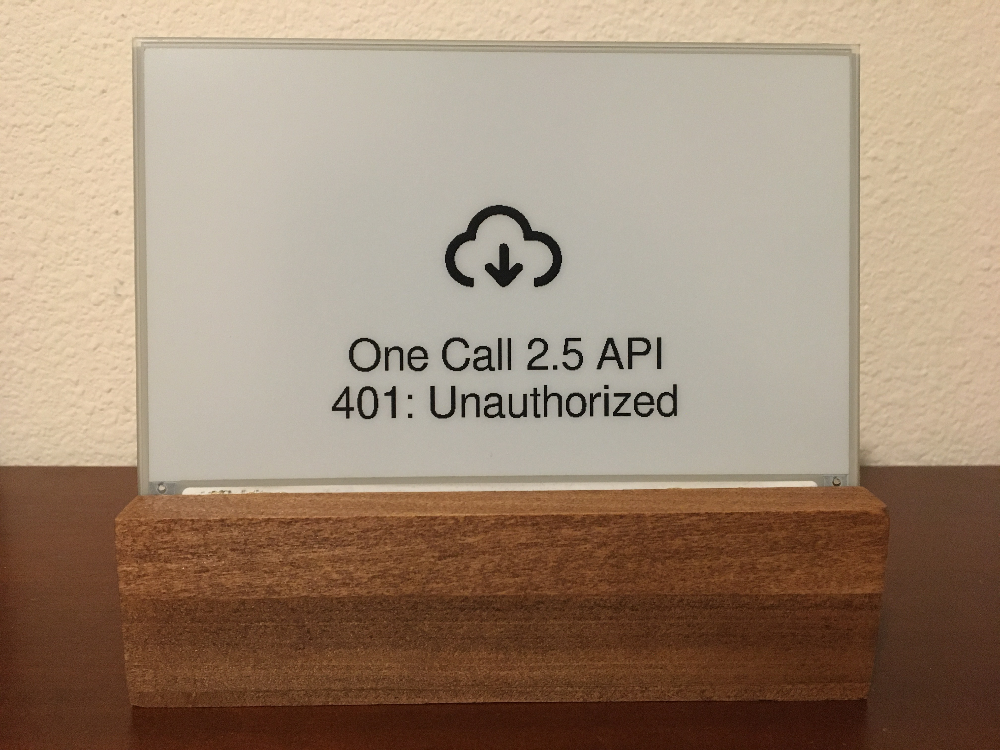
This error screen appears if an error (client or server) occurs when making an API request to OpenWeatherMap. The second line will give the error code followed by a descriptor phrase. Positive error codes correspond to HTTP response status codes, while error codes <= 0 indicate a client(esp32) error. The esp32 will retry once every SLEEP_DURATION (default = 30min).
<br/><br/>
In the example shown to the left, "401: Unauthorized" may be the result of an incorrect API key or that you are attempting to use the One Call v3 API without the proper account setup.

<br clear="left"/>

#### Time Server Error
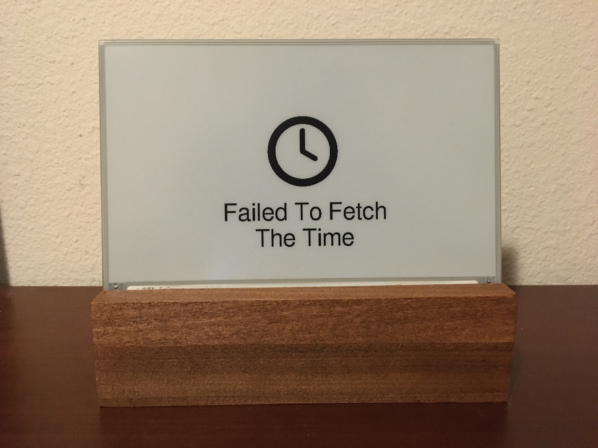
This error screen appears when the esp32 fails to fetch the time from NTP_SERVER_1/NTP_SERVER_2. This error sometimes occurs immediately after uploading to the esp32; in this case, just hit the reset button or wait for SLEEP_DURATION (default = 30min) and the esp32 to automatically retry.

<br clear="left"/>

---

## License

My work is licensed under the [GNU General Public License v3.0](LICENSE) with tools, fonts, and icons whose licenses are as follows:

| Name                                                                                                          | License                                                                               | Notes                                                                              |
|---------------------------------------------------------------------------------------------------------------|---------------------------------------------------------------------------------------|------------------------------------------------------------------------------------|
| [GNU FreeFont: FreeSans](https://www.gnu.org/software/freefont/)                                              | [GNU General Public License v3.0](https://www.gnu.org/software/freefont/license.html) | OpenType Font (.otf)                                                               |
| [Adafruit-GFX-Library: fontconvert](https://github.com/adafruit/Adafruit-GFX-Library/tree/master/fontconvert) | [BSD License](fonts/fontconvert/license.txt)                                          | CLI tool for preprocessing fonts to be used with the Adafruit_GFX Arduino library. |
| [Weather Icons](https://github.com/erikflowers/weather-icons) ('wi-**.svg')                                   | [SIL OFL 1.1](http://scripts.sil.org/OFL)                                             | The vast majority of the icons used in this project.                               |
| Other Icons (.svg)                                                                                            | Varies, please see [icons/README](icons/README)                                       | Other icons were collected from many different sources (too many to list here)     |
