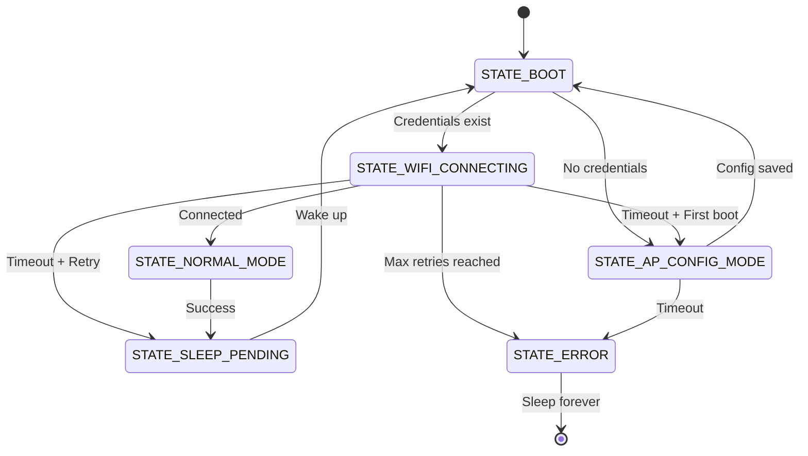

# ESP32 E-Paper Weather Display

A low-power weather display powered by an ESP32 and a 7.5" e-paper panel. Uses **Open-Meteo** for free weather data (no API key required).

<p float="left">
  
  
  
</p>

---

## Quick Start

```bash
cd platformio
pio run
pio run --target upload
pio device monitor --baud 115200
```

### First Boot

On first boot, the device creates a Wi-Fi access point for configuration.

---

## Setup

### Web Portal (Recommended)

1. **Power on the device**
2. Scan the QR code on the display, or connect to `weather_eink-AP`
3. Open: http://192.168.4.1 or http://weather.local
4. Configure WiFi credentials and location
5. Save → device restarts and begins updating

> **Security Note**: Setup runs over **unencrypted HTTP**. Perform on a trusted network.

### Alternative: Environment Variables

Create `.env` in the `platformio/` directory:

```env
WIFI_SSID=your_wifi
WIFI_PASSWORD=your_password
```

---

## State Machine

The firmware uses a deterministic state machine with deep sleep. For complete details, see [`docs/STATE_MACHINE.md`](docs/STATE_MACHINE.md).



---

## Features

- **No API Key** – Open-Meteo (free, personal use)
- **Easy Setup** – Captive portal with auto mobile detection
- **Auto Location** – Optional IP-based geolocation
- **Umbrella Indicator** – Rain probability at a glance
- **Error Screens** – Distinct icons for WiFi, NTP, API, Battery
- **Offline Mode** – Full simulation without WiFi

---

## Development & Testing

### Offline Mode (No WiFi)

Enable in `include/config.h`:

```c
#define USE_MOCKUP_DATA 1
```

Available scenarios: SUNNY, RAINY, SNOWY, CLOUDY, THUNDER

### Local Testing with act

Run GitHub Actions workflows locally:

```bash
# Install act
brew install act  # macOS
curl -s https://raw.githubusercontent.com/nektos/act/master/install.sh | sudo bash  # Linux

# Run state machine tests
act -j test-state-machine -P ubuntu-latest=catthehacker/ubuntu:act-latest

# Run blackbox matrix tests
act -j blackbox-matrix -P ubuntu-latest=catthehacker/ubuntu:act-latest
```

---

## Troubleshooting

| Issue | Fix |
|-------|-----|
| Display not updating | Check SPI wiring and BUSY pin |
| WiFi fails | Verify credentials and signal strength |
| Time sync issues | Check timezone settings |

For deeper debugging, see `platformio/AGENTS.md`.

---

## Hardware

- ESP32 Dev Module
- 7.5" e-paper display (800×480)
- Optional: BME280/BME680 sensor

---

## License

GPL v3.0. See original project for full attribution.