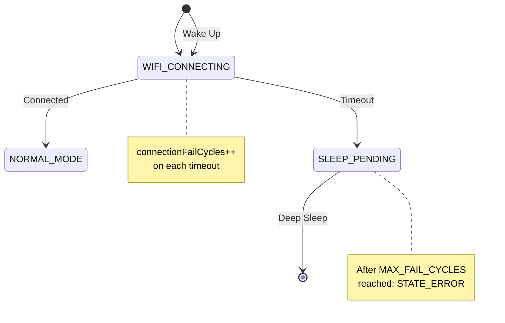

# Failure Handling Strategy

This document describes how the ESP32 Weather Station handles different types of failures and the rationale behind the design decisions.

## Overview

The firmware implements a tiered failure handling strategy based on the criticality of each subsystem:

| Subsystem | Persistent Counter | Max Failures | Final State | Recovery |
|-----------|-------------------|--------------|-------------|----------|
| **WiFi Connection** | ✅ Yes (`connectionFailCycles`) | Configurable (`MAX_FAIL_CYCLES`) | `STATE_ERROR` (permanent sleep) | Manual reset |
| **NTP Time Sync** | ❌ No | Infinite | `STATE_SLEEP_PENDING` (retry) | Automatic |
| **Weather API** | ❌ No | Infinite | `STATE_SLEEP_PENDING` (retry) | Automatic |

---

## WiFi Failure Handling

### Why WiFi is Special

WiFi is the **foundation** of all network operations. Without WiFi:
- NTP time synchronization is impossible
- Weather API requests cannot be made
- IP geolocation won't work

Persistent WiFi failures typically indicate:
- Wrong credentials
- Router offline
- Weak signal
- Network configuration issues

These are problems that **won't fix themselves** and may require user intervention.

### Implementation

```cpp
// In wifi_manager.cpp
RTC_DATA_ATTR uint8_t connectionFailCycles = 0;  // Persists across deep sleep

// On WiFi timeout:
if (!isFirstBoot) {
    connectionFailCycles++;
}

#if MAX_FAIL_CYCLES > 0
if (connectionFailCycles >= MAX_FAIL_CYCLES) {
    // Permanent error - sleep forever
    setFirmwareState(STATE_ERROR);
}
#endif
```

### Configuration

```cpp
// In config.h
#define MAX_FAIL_CYCLES  3   // 0 = infinite retries
```

| Value | Behavior |
|-------|----------|
| `0` | Infinite retries, never enters `STATE_ERROR` |
| `1` | One failure allowed, second failure → permanent sleep |
| `3` | (Default) Three failures allowed, fourth → permanent sleep |

### Flow Diagram



---

## NTP Failure Handling

### Why No Counter?

NTP (Network Time Protocol) failures are usually **transient**:
- NTP server temporarily unavailable
- Network congestion
- DNS resolution delay

These issues typically resolve themselves on the next attempt.

### Implementation

```cpp
// In main.cpp - updateWeather()
configTzTime(tzToUse, NTP_SERVER_1, NTP_SERVER_2);
isTimeConfigured = waitForSNTPSync(&currentTimInfo);

if (!isTimeConfigured) {
    Serial.println(TXT_TIME_SYNCHRONIZATION_FAILED);
    updateEinkStatus(TXT_TIME_SYNCHRONIZATION_FAILED);
    setFirmwareState(STATE_SLEEP_PENDING);
    return;  // Will retry on next wake
}
```

### Behavior

1. Display shows error status (if not silent mode)
2. Device enters deep sleep
3. On wake, retries NTP sync
4. **Never** enters permanent error state

### Display on Failure

The error message is displayed on the e-paper screen so the user knows what's happening, but the device will keep trying automatically.

---

## Weather API Failure Handling

### Why No Counter?

API failures are also typically **transient**:
- Open-Meteo server maintenance
- Rate limiting (rare with free tier)
- Network issues

Additionally, the firmware **preserves the last valid weather data**, so even if API fails, the display still shows useful (though slightly outdated) information.

### Implementation

```cpp
// In main.cpp - updateWeather()
int rxStatus = getOpenMeteoForecast(client, owm_onecall);

if (rxStatus != HTTP_CODE_OK) {
    globalStatus = "Open-Meteo Forecast API Error";
    setFirmwareState(STATE_SLEEP_PENDING);
    return;  // Will retry on next wake
}
```

### Data Preservation

```cpp
// Previous valid data is NEVER overwritten
// The display shows the last successful fetch
// Error is logged but doesn't block future retries
```

### Behavior

1. Log error to Serial
2. Set internal status message
3. Enter deep sleep
4. On wake, retry API request
5. **Never** enters permanent error state

---

## Design Rationale

### Why Different Strategies?

```
┌─────────────────────────────────────────────────────────────┐
│  WiFi                    NTP                    API         │
│  ─────                   ────                   ───         │
│                                                             │
│  • Required for           • Required for        • Required  │
│    everything               sync                  for data  │
│                                                             │
│  • Credentials may        • Usually fixes       • Usually   │
│    be wrong                 itself                fixes     │
│                                                   itself    │
│  • Router may be          • Server may be       • Server    │
│    offline                  down                  may be    │
│                                                   down      │
│  • User intervention      • Automatic           • Automatic │
│    often needed               recovery              recovery│
│                                                             │
│  ✅ Counter +           ❌ No counter          ❌ No counter│
│    MAX_FAIL_CYCLES                                          │
└─────────────────────────────────────────────────────────────┘
```

### Key Principles

1. **Fail Gracefully**: Always preserve previous valid data
2. **Don't Penalize Transient Issues**: NTP/API get infinite retries
3. **Detect Real Problems**: WiFi gets counter to catch credential/network issues
4. **User Control**: `MAX_FAIL_CYCLES = 0` allows infinite retries for all (for testing)

---

## Comparison Table

| Aspect | WiFi | NTP | API |
|--------|------|-----|-----|
| **Critical** | Yes (foundation) | Yes (for time sync) | No (data is cached) |
| **Counter** | `connectionFailCycles` | None | None |
| **Persists in RTC** | Yes | N/A | N/A |
| **Max Failures** | `MAX_FAIL_CYCLES` | Infinite | Infinite |
| **Permanent Error** | Possible | Never | Never |
| **Error Display** | Yes | Yes | Status only |
| **Auto Recovery** | Only if `MAX_FAIL_CYCLES = 0` | Always | Always |

---

## Failure Scenarios

### Scenario 1: WiFi Credentials Wrong

```
Boot 1: WiFi timeout, isFirstBoot=true → AP_CONFIG_MODE
  ↓
User fixes credentials
  ↓
Boot 2: WiFi OK, render OK, isFirstBoot=false
  ↓
User changes router password
  ↓
Boot 3-5: WiFi timeout, failCycles=1,2,3 → SLEEP (retry)
  ↓
Boot 6: WiFi timeout, failCycles=4 ≥ MAX_FAIL_CYCLES(3)
  ↓
STATE_ERROR → Sleep forever (manual reset needed)
```

### Scenario 2: NTP Server Down

```
Boot 1: WiFi OK → NTP fail → SLEEP
  ↓
Boot 2: WiFi OK → NTP fail → SLEEP
  ↓
Boot 3: WiFi OK → NTP fail → SLEEP
  ↓
(Never gives up, keeps retrying forever)
  ↓
Boot N: WiFi OK → NTP OK → Continue normally
```

### Scenario 3: API Rate Limited

```
Boot 1: WiFi OK → NTP OK → API fail (429) → SLEEP
  ↓
Boot 2: WiFi OK → NTP OK → API fail (429) → SLEEP
  ↓
Boot 3: WiFi OK → NTP OK → API OK → Update display
  ↓
(Shows last valid data during failures)
```

---

## Configuration Recommendations

### For Development/Testing

```cpp
#define MAX_FAIL_CYCLES  0   // Infinite retries, never enters STATE_ERROR
```

### For Production (Battery Powered)

```cpp
#define MAX_FAIL_CYCLES  5   // Give it several tries before giving up
```

### For Always-On Display

```cpp
#define MAX_FAIL_CYCLES  0   // Never give up, keep trying forever
```

---

## Troubleshooting

### Device keeps sleeping and retrying (NTP/API failure)

- Check Serial output for specific error
- Verify network connectivity
- Check if NTP servers are reachable
- Verify Open-Meteo API status

### Device entered STATE_ERROR (WiFi failure)

- Power cycle to reset `connectionFailCycles`
- Check WiFi credentials in RTC memory
- Verify router is online
- Check signal strength
- Consider increasing `MAX_FAIL_CYCLES` if network is unstable

### Want to disable all failure limits

```cpp
// In config.h
#define MAX_FAIL_CYCLES  0
```

This makes WiFi behave like NTP/API - infinite retries.

---

## Related Documents

- [STATE_MACHINE.md](STATE_MACHINE.md) - Detailed state machine documentation
- [AGENTS.md](../AGENTS.md) - Project overview and configuration
- `include/config.h` - Compile-time configuration options
