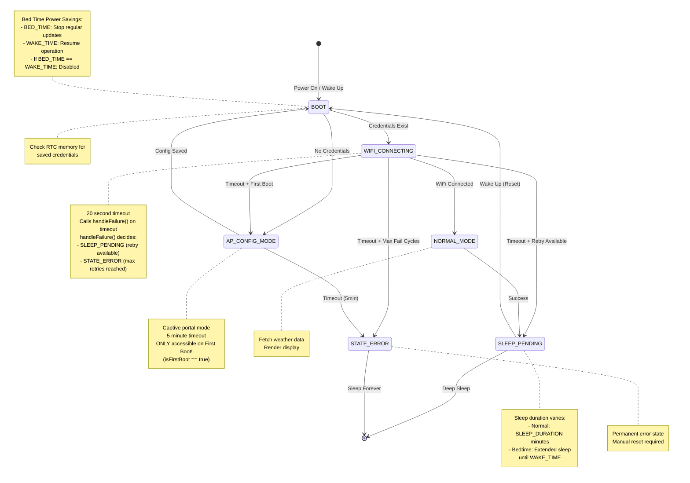
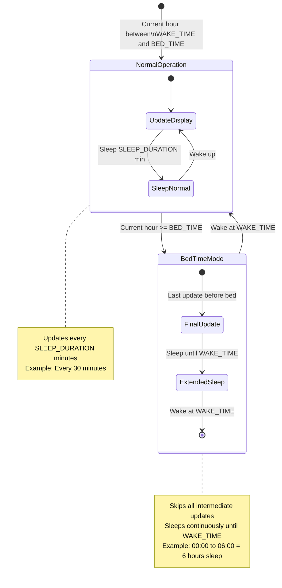
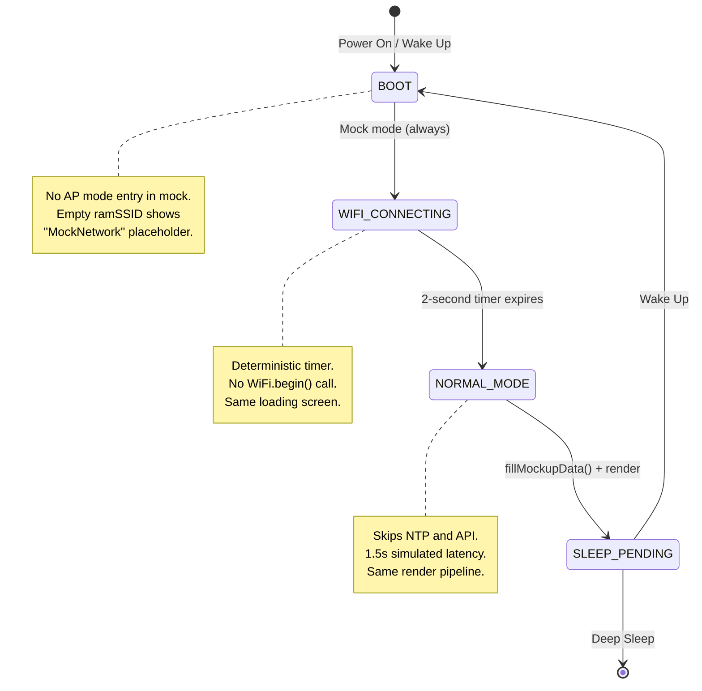

# ESP32 Weather Station State Machine

This document describes the firmware state machine implementation for the ESP32 Weather E-Paper Display project. The state machine manages WiFi connectivity, configuration mode, API data fetching, and error recovery with persistent state across deep sleep cycles.

## Table of Contents

- [Overview](#overview)
- [States](#states)
- [State Transitions](#state-transitions)
- [Persistent Variables](#persistent-variables)
- [Configuration](#configuration)
  - [MAX_FAIL_CYCLES](#max_fail_cycles)
  - [Bed Time Power Savings (BED_TIME / WAKE_TIME)](#bed-time-power-savings-bed_time--wake_time)
  - [Timeouts](#timeouts)
- [AP Mode Entry Conditions](#ap-mode-entry-conditions)
- [AP Mode Timeout Behavior](#ap-mode-timeout-behavior)
- [Failure Cycle Logic](#failure-cycle-logic)
- [Implementation Details](#implementation-details)

---

## Overview

The firmware implements a deterministic state machine designed for battery-powered operation with deep sleep. All states transition based on timeouts or events, not retry counters. The state persists across deep sleep cycles using RTC (Real-Time Clock) memory.

### State Machine Diagram



### Bed Time Behavior Diagram



---

## States

### 1. STATE_BOOT

**Purpose**: Initial state after device power-on or wake from deep sleep.

**Entry Actions**:
- Initialize WiFi subsystem
- Check if WiFi credentials exist in RTC memory (`ramSSID`)

**Transitions**:
| Condition | Next State | Actions |
|-----------|------------|---------|
| `strlen(ramSSID) > 0` (credentials exist) | `STATE_WIFI_CONNECTING` | Start WiFi connection with loading screen |
| `ramSSID` is empty | `STATE_AP_CONFIG_MODE` | Start AP mode immediately (no credentials) |

**Notes**:
- This state executes only once per boot cycle
- No timeout applies to this state
- Unlike documented in older versions, AP mode is entered whenever credentials are missing, regardless of `isFirstBoot` flag

---

### 2. STATE_WIFI_CONNECTING

**Purpose**: Attempt to establish WiFi connection with a defined timeout.

**Entry Actions**:
- Call `WiFi.begin(ramSSID, ramPassword)`
- Record start time: `wifiStartTime = millis()`
- Display "Connecting..." screen (unless silent mode)

**During State**:
- Continuously poll `WiFi.status()`

**Transitions**:

| Condition | Next State | Actions |
|-----------|------------|---------|
| `WiFi.status() == WL_CONNECTED` | `STATE_NORMAL_MODE` | Reset `connectionFailCycles = 0`, set `isFirstBoot = false` |
| Timeout reached AND `isFirstBoot == true` | `STATE_AP_CONFIG_MODE` | Start AP for configuration |
| Timeout reached AND `isFirstBoot == false` | `STATE_SLEEP_PENDING` or `STATE_ERROR` | Calls `handleFailure(FAILURE_WIFI, ...)`. `handleFailure()` increments counter, draws error screen, and decides: `SLEEP_PENDING` if retries remain, `STATE_ERROR` if max reached |
| Timeout reached AND `isFirstBoot == false` AND `MAX_WIFI_FAIL_CYCLES > 0` AND `connectionFailCycles >= MAX_WIFI_FAIL_CYCLES` | `STATE_ERROR` | Same path as above — `handleFailure()` evaluates criticality and transitions to `STATE_ERROR` |

**Timeout**: Defined by `wifiConfig.wifiConnectTimeout` (default: 20 seconds)

**Important Note on `isFirstBoot`**:
When WiFi connects successfully, `isFirstBoot` is **immediately** set to `false` and persisted to RTC memory. This ensures that even if subsequent steps fail (NTP sync, API fetch), the device will not enter AP mode on future connection failures. The device will follow the retry cycle instead.

---

### 3. STATE_AP_CONFIG_MODE

**Purpose**: Provide a captive portal for WiFi configuration.

**Entry Actions**:
- Start WiFi Access Point: `WiFi.softAP("weather_eink-AP")`
- Start DNS server for captive portal (port 53)
- Start AsyncWebServer (port 80)
- Start mDNS responder: `weather.local`
- Record start time: `portalStartTime = millis()`
- Display AP mode screen with SSID, IP (192.168.4.1), and timeout countdown

**During State**:
- Process DNS requests (`dnsServer.processNextRequest()`)
- Handle HTTP requests (setup page, captive portal detection, save endpoint)
- Monitor for configuration save (`/save` endpoint sets `portalActive = false`)

**Transitions**:

| Condition | Next State | Actions |
|-----------|------------|---------|
| User saves valid configuration | `STATE_BOOT` | Stop AP/DNS, apply new credentials, restart connection flow |
| Timeout reached (`configTimeout`) | `STATE_ERROR` | Stop AP, display error, set `isErrorState = true`, sleep forever |

**Timeout**: Defined by `wifiConfig.configTimeout` (default: 300 seconds = 5 minutes)

**Important Notes**:
- AP mode can be entered in two situations:
  1. **No credentials**: At boot when `ramSSID` is empty (first boot or after RTC clear)
  2. **First boot timeout**: When WiFi connection times out and `isFirstBoot == true`
- When entering AP mode from WiFi timeout (scenario 2), an **error screen** is displayed first:
  - Icon: WiFi with strike-through (`wifi_off_196x196`)
  - Message: "WiFi Connection Failed"
  - Duration: 3 seconds before AP mode starts
- The timeout only applies while `portalActive == true` (waiting for user input)
- After user saves configuration, there's a 3-second delay before transitioning to BOOT state
- The web server provides captive portal detection for automatic redirect on mobile devices

---

### 4. STATE_NORMAL_MODE

**Purpose**: Fetch weather data from API and update the display.

**Entry Actions**:
- NTP time synchronization
- IP-based geolocation if `ramAutoGeo == true`
- Display update in progress status

**During State**:
- Fetch weather data from Open-Meteo API
- Fetch air quality data (if enabled)
- Read BME sensor data
- Render display with current conditions and forecast

**Transitions**:

| Condition | Next State | Actions |
|-----------|------------|---------|
| Data fetch and render successful | `STATE_SLEEP_PENDING` | Set `isFirstBoot = false`, reset `connectionFailCycles = 0` |
| API fetch fails | `STATE_SLEEP_PENDING` | Keep previous valid data (do NOT overwrite) |
| Time sync fails | `STATE_SLEEP_PENDING` | Display error status, continue with last known time |
| Sensor read fails | `STATE_SLEEP_PENDING` | Display dashes for missing sensor data |

**Notes**:
- Valid data is NEVER overwritten by API failures
- Previous weather data persists across failed updates
- `isFirstBoot` is set to `false` only after first successful render
- This state is primarily handled in `main.cpp`, not `wifi_manager.cpp`

---

### 5. STATE_SLEEP_PENDING

**Purpose**: Prepare for and enter deep sleep to conserve battery.

**Entry Actions**:
- Calculate next wake time based on `SLEEP_DURATION` and bedtime logic
- Power down display and sensors

**Transitions**:

| Condition | Next State |
|-----------|------------|
| After `beginDeepSleep()` completes | Wake → `STATE_BOOT` |

**Wake Behavior**:
- Device wakes from deep sleep after timer expires
- Program restarts from `setup()`
- State re-enters `STATE_BOOT`
- All RTC memory variables persist (including credentials, location, counters)

**Notes**:
- This state is primarily handled in `main.cpp`
- Sleep duration can be extended during "bedtime" hours to save battery

---

### 6. STATE_ERROR

**Purpose**: Permanent error state when maximum retry attempts are exhausted or AP configuration times out.

**Entry Actions**:
- Display error message on e-paper screen
- Set `isErrorState = true` (persists across deep sleep)
- Log error to Serial

**Behavior**:
- Enter **indefinite deep sleep** (no timer wakeup)
- Device will NOT wake up automatically
- User must manually reset or power cycle to recover

**Recovery**:
- Press RESET button
- Power cycle the device
- This clears RTC memory (including `connectionFailCycles` and `isErrorState`)

**When Entered**:
1. WiFi fails `MAX_WIFI_FAIL_CYCLES` consecutive times (if `MAX_WIFI_FAIL_CYCLES > 0`)
2. AP configuration mode times out without receiving valid credentials

---

## State Transitions

### Complete Transition Table

| Current State | Event | Condition | Next State | Actions |
|---------------|-------|-----------|------------|---------|
| BOOT | Credentials exist | `strlen(ramSSID) > 0` | WIFI_CONNECTING | Start connection attempt |
| BOOT | No credentials | `ramSSID` empty | AP_CONFIG_MODE | Start AP immediately |
| WIFI_CONNECTING | WiFi connected | `WL_CONNECTED` | NORMAL_MODE | Reset fail counter |
| WIFI_CONNECTING | Timeout, first boot | `isFirstBoot == true` | AP_CONFIG_MODE | Allow configuration |
| WIFI_CONNECTING | Timeout, post-first-boot | `isFirstBoot == false` | SLEEP_PENDING or STATE_ERROR | Calls `handleFailure()`. Retries → SLEEP_PENDING. Max reached → STATE_ERROR |
| WIFI_CONNECTING | Timeout, max failures | `isFirstBoot == false` AND `MAX_WIFI_FAIL_CYCLES > 0` AND `connectionFailCycles >= MAX_WIFI_FAIL_CYCLES` | STATE_ERROR | `handleFailure()` critical path |
| AP_CONFIG_MODE | Config saved | Valid POST to `/save` | BOOT | Apply settings, restart flow |
| AP_CONFIG_MODE | Timeout | `portalTimeout` exceeded | STATE_ERROR | Permanent sleep |
| NORMAL_MODE | Success | Render complete | SLEEP_PENDING | Reset counters, sleep |
| NORMAL_MODE | API failure | HTTP error | SLEEP_PENDING | Preserve data, sleep |
| SLEEP_PENDING | Wake up | Deep sleep ends | BOOT | Restart from beginning |
| STATE_ERROR | (none) | Permanent sleep | (none) | Manual reset required |

---

## Persistent Variables

Variables stored in RTC memory survive deep sleep but are cleared on power loss:

| Variable | Type | Purpose |
|----------|------|---------|
| `isFirstBoot` | `bool` | `true` until first successful data fetch and render |
| `connectionFailCycles` | `uint8_t` | Consecutive WiFi connection failures after first boot |
| `ntpFailCycles` | `uint8_t` | Consecutive NTP synchronization failures |
| `apiFailCycles` | `uint8_t` | Consecutive API request failures |
| `isErrorState` | `bool` | Permanent error state flag (survives deep sleep) |
| `ramSSID[33]` | `char[]` | WiFi SSID (32 chars + null) |
| `ramPassword[64]` | `char[]` | WiFi password (63 chars + null) |
| `ramCity[64]` | `char[]` | Location city name |
| `ramCountry[64]` | `char[]` | Location country name |
| `ramLat[21]` | `char[]` | Latitude (high precision) |
| `ramLon[21]` | `char[]` | Longitude (high precision) |
| `ramTimezone[64]` | `char[]` | POSIX timezone string |
| `ramAutoGeo` | `bool` | Enable automatic IP geolocation |
| `ramTimezoneMode` | `uint8_t` | `TIMEZONE_MODE_AUTO` or `TIMEZONE_MODE_MANUAL` |
| `rtcInitialized` | `bool` | RTC memory has been initialized |

---

## Configuration

### MAX_FAIL_CYCLES (Per-Subsystem)

Located in `include/config.h`:

```cpp
/// @defgroup retry_policy Retry Policy Configuration
/// @brief Maximum consecutive failures before entering permanent error state
/// @details Set to 0 for infinite retries (device never enters STATE_ERROR)
/// @{
#define MAX_WIFI_FAIL_CYCLES  10  ///< WiFi connection failures
#define MAX_NTP_FAIL_CYCLES   10  ///< NTP synchronization failures
#define MAX_API_FAIL_CYCLES   10  ///< API request failures
/// @}
```

Each subsystem has its own independent failure counter and limit:

| Constant | Default | Behavior when `0` | Behavior when `N > 0` |
|----------|---------|-------------------|----------------------|
| `MAX_WIFI_FAIL_CYCLES` | 10 | Infinite WiFi retries | Error after N consecutive WiFi failures |
| `MAX_NTP_FAIL_CYCLES` | 10 | Infinite NTP retries | Error after N consecutive NTP failures |
| `MAX_API_FAIL_CYCLES` | 10 | Infinite API retries | Error after N consecutive API failures |

**Note**: Set to `0` for any subsystem you want to retry infinitely, regardless of failures.

### Bed Time Power Savings (BED_TIME / WAKE_TIME)

Located in `src/config.cpp`:

```cpp
// Bed Time Power Savings.
// If BED_TIME == WAKE_TIME, then this battery saving feature will be disabled.
// (range: [0-23])
const int BED_TIME  = 12; // Last update at 00:00 (midnight) until WAKE_TIME.
const int WAKE_TIME = 13; // Hour of first update after BED_TIME, 06:00.
```

This feature extends sleep duration during "night hours" to save battery power.

#### How It Works

| Parameter | Description | Range |
|-----------|-------------|-------|
| `BED_TIME` | Hour when the device stops regular updates and enters extended sleep | 0-23 |
| `WAKE_TIME` | Hour when the device resumes normal operation | 0-23 |

**Important**: If `BED_TIME == WAKE_TIME`, this feature is **disabled** and the device follows `SLEEP_DURATION` continuously.

#### Sleep Behavior

```
Normal Hours (WAKE_TIME to BED_TIME):
  Device wakes every SLEEP_DURATION minutes
  
Bed Time (BED_TIME to WAKE_TIME):
  Device sleeps continuously until WAKE_TIME
  Skips all intermediate updates
```

#### Examples

**Example 1: Night Sleep (Default)**
```cpp
const int BED_TIME  = 0;   // Midnight
const int WAKE_TIME = 6;   // 6 AM
const int SLEEP_DURATION = 30; // 30 minutes
```
- 06:00 - Update, sleep 30 min
- 06:30 - Update, sleep 30 min
- ...
- 23:30 - Update, sleep until 06:00
- 06:00 - Update (next day)

**Example 2: Update Once Daily**
```cpp
const int BED_TIME  = 8;   // 8 AM
const int WAKE_TIME = 8;   // 8 AM
const int SLEEP_DURATION = 1440; // 24 hours
```
- Device updates exactly once per day at 8:00 AM
- Note: BED_TIME == WAKE_TIME disables bedtime logic, but alignment starts at 8 AM

**Example 3: Disabled Bedtime**
```cpp
const int BED_TIME  = 6;
const int WAKE_TIME = 6;
```
- Device updates every `SLEEP_DURATION` minutes continuously
- No extended sleep periods

#### Mock Mode State Machine Behavior

When `USE_MOCKUP_DATA 1` is set in `include/config.h`, the state machine executes the **same visual flow** as production mode, but with simulated network operations:

### Differences from Production Mode

| Aspect | Production Mode | Mock Mode (`USE_MOCKUP_DATA 1`) |
|--------|-----------------|--------------------------------|
| **WiFi Connection** | Calls `WiFi.begin()` and polls `WiFi.status()` | Deterministic 2-second timer, no hardware calls |
| **SSID Display** | Shows real `ramSSID` | Shows `ramSSID` if available, `"MockNetwork"` placeholder otherwise (RTC RAM is **never modified**) |
| **NTP Time Sync** | Calls `configTzTime()` and `waitForSNTPSync()` | Skipped — `fillMockupData()` sets the internal clock directly via `settimeofday()` |
| **Geolocation** | Calls `locateByIpAddress()` if `ramAutoGeo == true` | Skipped — mock data uses fixed coordinates |
| **API Fetch** | HTTP request to Open-Meteo | `delay(1500)` simulates network latency, then `fillMockupData()` injects synthetic data |
| **RSSI Display** | `WiFi.RSSI()` | Fixed mock value `-55` |

### Visual Parity Guarantee

No screen, label, or timing changes between mock and production:
- **BOOT** → Same splash/initialization
- **WIFI_CONNECTING** → Same `"Connecting to Wi-Fi..."` screen for ~2 seconds
- **NORMAL_MODE loading** → Same `"Fetching weather..."` screen for ~1.5 seconds
- **Dashboard** → Identical rendering with mock data
- **SLEEP_PENDING** → Dashboard remains visible
- **Deep Sleep** → Normal sleep/wake cycle

### State Transitions in Mock Mode



## Implementation Details

The sleep duration calculation (in `time_coordinator.cpp`):

1. Calculate `bedtimeHour` relative to `WAKE_TIME`
2. If predicted wake time falls within bedtime hours → sleep until `WAKE_TIME`
3. Otherwise → use normal `SLEEP_DURATION` interval

The actual sleep duration includes:
- Base calculation (seconds until next wake)
- +3 seconds offset (to avoid wake-before-update race conditions)
- ×1.0015 multiplier (ESP32 RTC drift compensation)

### Timeouts

Located in `src/wifi_manager.cpp`:

```cpp
DeviceConfig wifiConfig = {
    .wifiConnectTimeout = 20,   // WiFi connection timeout (seconds)
    .configTimeout = 300        // AP mode timeout (seconds) = 5 minutes
};
```

| Timeout | Default | Description |
|---------|---------|-------------|
| `wifiConnectTimeout` | 20s | Time to wait for WiFi connection before giving up |
| `configTimeout` | 300s (5min) | Time AP mode stays active waiting for configuration |

---

## AP Mode Entry Conditions

> ⚠️ **CRITICAL**: AP Configuration Mode is **ONLY** available during the first boot (`isFirstBoot == true`). Once the device has successfully connected and fetched weather data at least once, AP mode becomes **permanently inaccessible**. WiFi failures on subsequent boots will follow the retry/error path, never the configuration path.

The device enters AP Configuration Mode (`STATE_AP_CONFIG_MODE`) in exactly **two scenarios**:

### Scenario 1: No Stored Credentials (Boot)

**Trigger**: Device boots with empty `ramSSID`

**Flow**:
```
STATE_BOOT → (ramSSID empty) → STATE_AP_CONFIG_MODE
```

**Occurs when**:
- First boot (fresh device)
- After power loss (RTC memory cleared)
- After manual RTC reset
- If credentials were never saved

### Scenario 2: First Boot WiFi Timeout

**Trigger**: WiFi connection timeout during first boot

**Flow**:
```
STATE_WIFI_CONNECTING → (timeout AND isFirstBoot == true) → STATE_AP_CONFIG_MODE
```

**Occurs when**:
- Credentials exist but are incorrect
- WiFi network is unreachable
- Signal is too weak
- Router is offline

### Important Differences

| Aspect | Scenario 1 (No Credentials) | Scenario 2 (Timeout) |
|--------|----------------------------|---------------------|
| `isFirstBoot` | Usually `true` | Always `true` |
| User action required | Must configure WiFi | Can retry or reconfigure |
| Previous connection | Never connected | Never successfully connected |

---

## AP Mode Timeout Behavior

### How the Timeout Works

The AP mode timeout is **conditional** - it only counts down while actively waiting for user input:

```cpp
// Only active if portal is waiting for input
if (runtime.portalActive && (millis() - runtime.portalStartTime > wifiConfig.configTimeout * 1000)) {
    // Timeout triggered
}
```

### Timeout Flow

1. **AP Started**: `portalStartTime = millis()`, `portalActive = true`
2. **User Saves Config**: `portalActive = false` (timeout stops counting)
3. **3-Second Delay**: Device shows success message
4. **Transition to BOOT**: AP stops, normal flow resumes

### If Timeout Reaches Limit

If no configuration is saved within `configTimeout` (default 5 minutes):

1. AP and DNS server are stopped
2. Error screen is displayed
3. `isErrorState` is set to `true`
4. Device enters `STATE_ERROR`
5. Indefinite deep sleep (no auto-recovery)

### Modifying the Timeout

Edit in `src/wifi_manager.cpp`:

```cpp
DeviceConfig wifiConfig = {
    .wifiConnectTimeout = 20,
    .configTimeout = 300  // Change this value (in seconds)
};
```

Or for testing, temporarily use a shorter timeout:
```cpp
.configTimeout = 60  // 1 minute for testing
```

---

## Failure Cycle Logic

### Per-Subsystem Failure Tracking

The firmware tracks failures **independently for each subsystem** rather than using a single global counter:

| Subsystem | Counter Variable | Max Config | Purpose |
|-----------|------------------|------------|---------|
| **WiFi Connection** | `connectionFailCycles` | `MAX_WIFI_FAIL_CYCLES` | WiFi network connectivity |
| **NTP Time Sync** | `ntpFailCycles` | `MAX_NTP_FAIL_CYCLES` | Time synchronization |
| **API Request** | `apiFailCycles` | `MAX_API_FAIL_CYCLES` | Weather data fetch |

#### Why Separate Counters Instead of Global?

**Granular Control**: Different subsystems may deserve different tolerance levels:
- WiFi might fail intermittently due to router issues → tolerate 10+ failures
- API might be temporarily down → tolerate 5 failures
- NTP rarely fails if WiFi works → tolerate 3 failures

**Isolation**: A failure in one subsystem doesn't "drain" the tolerance of others:
```
Scenario with GLOBAL counter (bad):
  Boot 1: WiFi fails    (counter: 1/10)
  Boot 2: WiFi fails    (counter: 2/10)
  Boot 3: NTP fails     (counter: 3/10)
  ...
  Boot 10: API fails    (counter: 10/10 → STATE_ERROR)
  Result: Device enters error state due to API, but WiFi and API actually work!

Scenario with PER-SUBSYSTEM counters (good):
  Boot 1: WiFi fails    (wifi: 1/10, ntp: 0, api: 0)
  Boot 2: WiFi fails    (wifi: 2/10, ntp: 0, api: 0)
  Boot 3: NTP fails     (wifi: 2/10, ntp: 1/3, api: 0)
  ...
  Boot 10: WiFi fails   (wifi: 10/10 → STATE_ERROR)
  Result: Only WiFi failures trigger error; NTP/API tracked separately
```

**Better Diagnostics**: The error screen shows exactly which subsystem failed:
```cpp
// Error display shows specific icon and message per failure type
[FAILURE_WIFI] = { &connectionFailCycles, MAX_WIFI_FAIL_CYCLES, wifi_off_196x196, "WiFi" },
[FAILURE_NTP]  = { &ntpFailCycles,        MAX_NTP_FAIL_CYCLES,  wi_time_4_196x196,    "NTP" },
[FAILURE_API]  = { &apiFailCycles,        MAX_API_FAIL_CYCLES,  wi_cloud_down_196x196,"API" },
```

### What Counts as a Failure Cycle?

A "failure cycle" is defined as a complete boot where:
1. Device attempts to connect to WiFi (`STATE_WIFI_CONNECTING`)
2. WiFi connection times out without success
3. `handleFailure()` is called — it increments the counter, displays an error screen, and transitions to either `STATE_SLEEP_PENDING` (to retry later) or `STATE_ERROR` (if max cycles reached)

### When is the Counter Incremented?

The `connectionFailCycles` counter is **only incremented when `isFirstBoot == false`**:

```cpp
if (!isFirstBoot) {
    connectionFailCycles++;
}
```

This means:
- **First boot failures**: Counter stays at 0, device enters AP mode for configuration
- **Subsequent failures**: Counter increments, device either retries or enters error state

> ⚠️ **Important**: `isFirstBoot` is set to `false` as soon as WiFi connects successfully (not at the end of the update cycle). This ensures that even if NTP or API fails later, the device won't enter AP mode on subsequent connection failures.

### When is the Counter Reset?

The counter is reset to 0 when:
1. WiFi connects successfully (`STATE_WIFI_CONNECTING` → `STATE_NORMAL_MODE`)
2. Weather data is fetched and rendered successfully (end of `STATE_NORMAL_MODE`)

### Example Scenario (MAX_WIFI_FAIL_CYCLES = 3)

| Boot # | isFirstBoot | WiFi Result | Fail Cycles | Action | Next State |
|--------|-------------|-------------|-------------|--------|------------|
| 1 | true | Timeout | 0 | First boot → AP mode | AP_CONFIG_MODE |
| 2 | true* | Config saved → Connect | 0 | Connected! WiFi ok | NORMAL_MODE |
| 2a | false | NTP fails → Sleep | 0 | isFirstBoot cleared on WiFi connect | SLEEP_PENDING |
| 3 | false | Timeout | 1 | Retry (1/3) | SLEEP_PENDING |
| 4 | false | Timeout | 2 | Retry (2/3) | SLEEP_PENDING |
| 5 | false | Timeout | 3 | Retry (3/3) | SLEEP_PENDING |
| 6 | false | Timeout | 4 | Max reached! | STATE_ERROR |

\* After WiFi connects successfully, `isFirstBoot` is immediately set to `false` (persisted in RTC memory)

### Example with Multiple Subsystem Failures

Different counters track different failures independently:

| Boot # | WiFi | NTP | API | WiFi Ctr | NTP Ctr | API Ctr | Result |
|--------|------|-----|-----|----------|---------|---------|--------|
| 1 | OK | Fail | OK | 0 | 1 | 0 | Sleep, retry later |
| 2 | OK | OK | Fail | 0 | 0 | 1 | Sleep, retry later |
| 3 | Fail | OK | OK | 1 | 0 | 0 | Sleep, retry later |
| 4 | Fail | Fail | OK | 2 | 1 | 0 | Sleep, retry later |
| 5 | Fail | OK | Fail | 3 | 0 | 1 | Sleep, retry later |
| ... | ... | ... | ... | ... | ... | ... | ... |
| 12 | Fail | OK | OK | 10 | 0 | 2 | **STATE_ERROR** (WiFi max reached) |

### Post-First Boot Failure Flow

When the device has connected successfully before (`isFirstBoot == false`) and WiFi fails:

```
Boot N:  WIFI_CONNECTING (timeout)
         ↓
         connectionFailCycles++
         ↓
         SLEEP_PENDING ──→ Deep Sleep
                              ↓
Boot N+1: BOOT ──→ WIFI_CONNECTING (timeout again)
                   ↓
                   connectionFailCycles++
                   ↓
                   SLEEP_PENDING ──→ Deep Sleep
                                        ↓
Boot N+2: BOOT ──→ WIFI_CONNECTING (timeout again)
                   ↓
                   connectionFailCycles++ (now equals MAX_FAIL_CYCLES)
                   ↓
                   STATE_ERROR ──→ Sleep Forever (manual reset required)
```

**Key Point**: The device NEVER goes to AP_CONFIG_MODE after first boot. It cycles through:
1. `WIFI_CONNECTING` → `SLEEP_PENDING` (retry with counter increment)
2. Eventually: `WIFI_CONNECTING` → `STATE_ERROR` (permanent sleep)

---

## Error Screens

The firmware displays specific error screens for different failure types using distinct icons:

### Error Icons

| Failure Type | Icon | Description |
|--------------|------|-------------|
| **WiFi Connection** | `wifi_off_196x196` | WiFi symbol with strike-through bar |
| **NTP Time Sync** | `wi_time_4_196x196` | Clock icon |
| **API Request** | `wi_cloud_down_196x196` | Cloud with downward arrow |
| **Battery Low** | `battery_alert_0deg_196x196` | Battery with alert indicator |
| **AP Timeout** | `wifi_off_196x196` | WiFi symbol with strike-through bar |

### When Error Screens Are Shown

1. **First Boot WiFi Failure** → Before entering AP mode
   - Icon: `wifi_off_196x196`
   - Message: "WiFi Connection Failed"
   - Duration: 3 seconds

2. **Post-First-Boot Failures** → Via `handleFailure()`
   - Only shown if `SILENT_STATUS` is `false` OR error is critical
   - Critical errors: Battery, AP timeout, or max retry cycles reached

3. **Permanent Errors (STATE_ERROR)** → Always shown
   - Device enters indefinite sleep after displaying

### Error Screen Implementation

Error screens are rendered using `drawLoading()` or `drawError()` from `display_utils.cpp`:

```cpp
// Example: WiFi error on first boot
drawLoading(wifi_off_196x196, TXT_WIFI_CONNECTION_FAILED);
delay(3000);

// Example: NTP error via handleFailure
handleFailure(FAILURE_NTP, TXT_FAILED_TO_FETCH_TIME, "");
```

---

## Implementation Details

### File Structure

| File | Purpose |
|------|---------|
| `include/wifi_manager.h` | State enum, RTC variable declarations, function prototypes |
| `src/wifi_manager.cpp` | Core state machine implementation (`wifiManagerLoop()`) |
| `src/wifi_manager_handlers.cpp` | HTTP request handlers, configuration validation |
| `src/main.cpp` | `STATE_NORMAL_MODE` implementation, error display, deep sleep entry |
| `include/config.h` | `MAX_FAIL_CYCLES` compile-time constant |

### Key Functions

```cpp
// State machine entry and loop
void wifiManagerSetup();
void wifiManagerLoop();

// State transition helper
void setFirmwareState(FirmwareState newState);

// AP mode handler
void startAP();

// Configuration save handler
void handleConfigSave(AsyncWebServerRequest* request);

// Validation helper functions
bool validateLatitude(const char* latStr);
bool validateLongitude(const char* lonStr);
bool validateTimezone(const char* tzStr);
void sanitizeString(const char* input, char* output, size_t outLen, bool allowSpace);
void sanitizeSSID(const char* input, char* output, size_t outLen);
void sanitizeCityCountry(const char* input, char* output, size_t outLen);
void safeCopy(const char* src, char* dest, size_t destLen);
bool applyTimezone(const char* tzStr);

// Deep sleep entry (main.cpp)
void beginDeepSleep(unsigned long startTime, uint32_t sleepDuration);
```

### Thread Safety

The state machine is single-threaded and runs in the main `loop()`. No concurrent access issues exist as there are no ISRs modifying state.

### Memory Safety

- All buffers use `sizeof(buffer) - 1` for string operations
- `strlcpy` is used for safe string copying with guaranteed null-termination
- No dynamic memory allocation in state handlers

---

## Troubleshooting

### Device keeps entering AP mode
- Check that `ramSSID` is being saved correctly via `/save` endpoint
- Verify `/save` endpoint is receiving correct POST data (check Serial output)
- Check if credentials are actually being stored in RTC memory
- Power loss clears RTC memory - this is expected behavior

### Device sleeps forever (STATE_ERROR)
- Check `connectionFailCycles` in Serial output
- Verify `MAX_WIFI_FAIL_CYCLES` / `MAX_NTP_FAIL_CYCLES` / `MAX_API_FAIL_CYCLES` settings in `include/config.h`
- Power cycle to clear RTC memory and reset counters
- Check if AP mode timeout was reached (5 minutes without configuration)

### Cannot access configuration portal
- Connect to "weather_eink-AP" WiFi network
- Navigate to `192.168.4.1` or `weather.local`
- Some devices may need to disable mobile data for captive portal to work
- Check Serial output for AP start confirmation

### Data not updating but device stays awake
- Check `STATE_NORMAL_MODE` implementation in `main.cpp`
- Verify API responses with `DEBUG_LEVEL >= 2` in `include/config.h`
- Previous valid data is preserved - this is expected behavior on API failure

---

## License

This state machine implementation is part of the ESP32 Weather E-Paper Display project and follows the same GPL v3 license.
